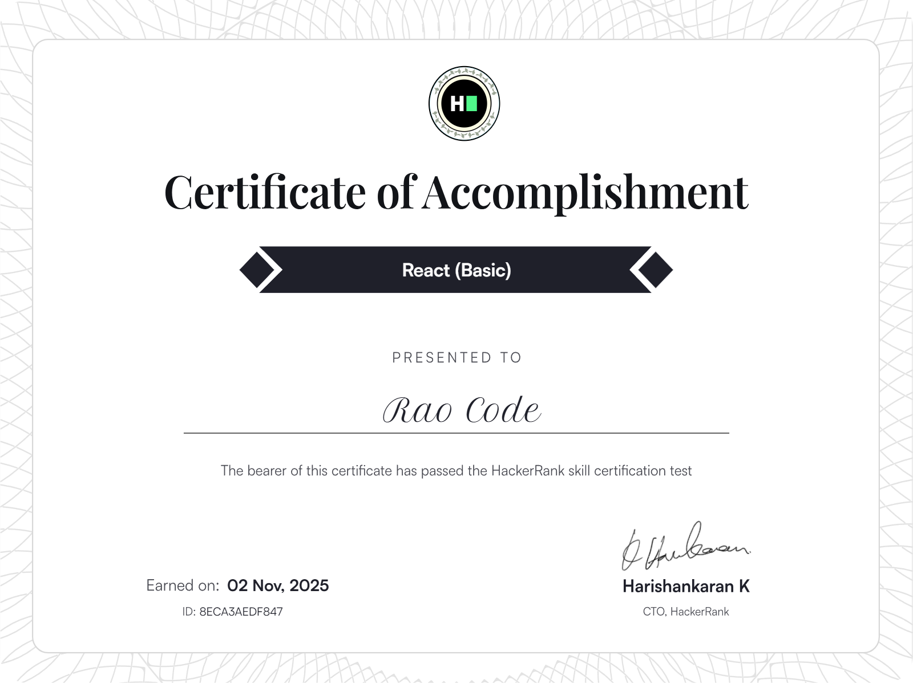
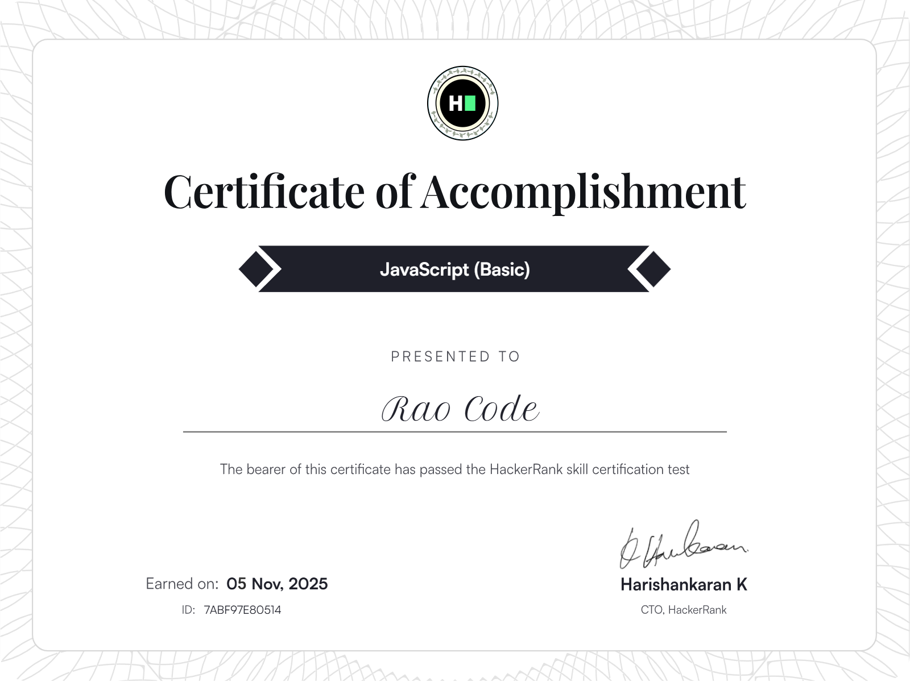
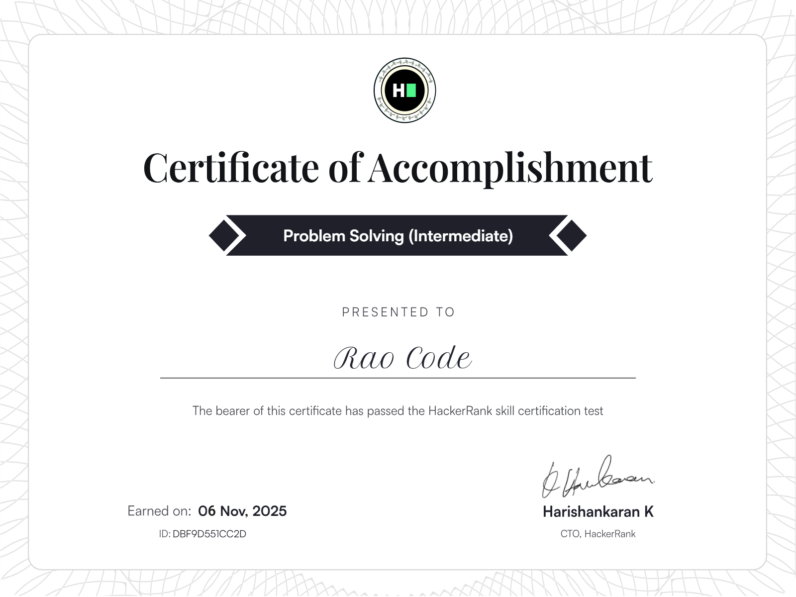
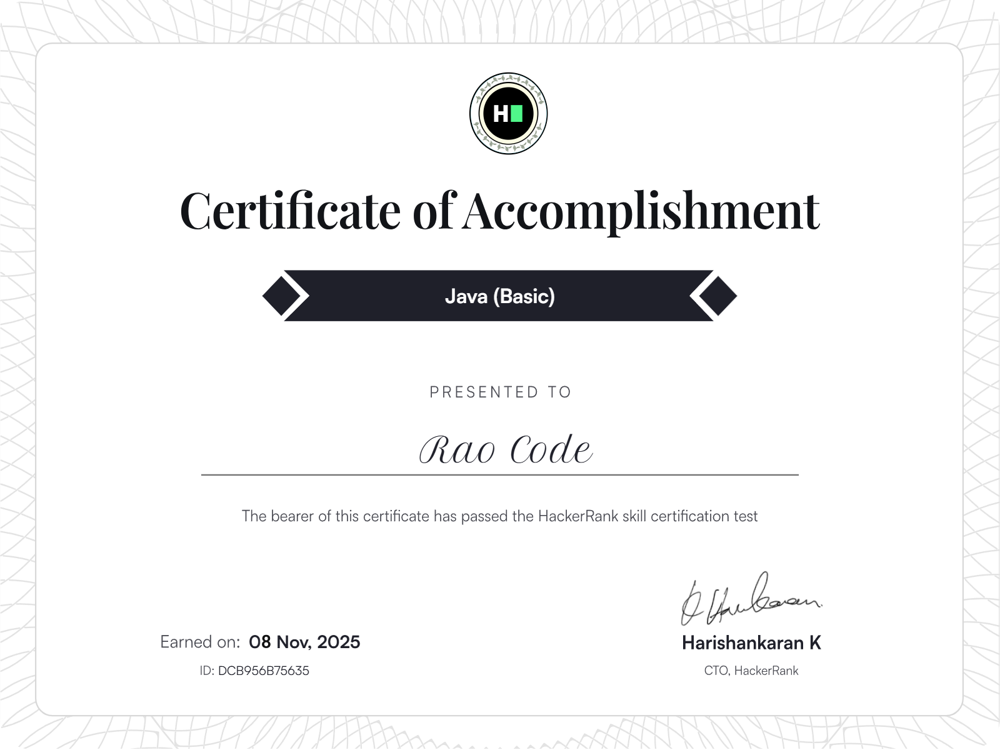
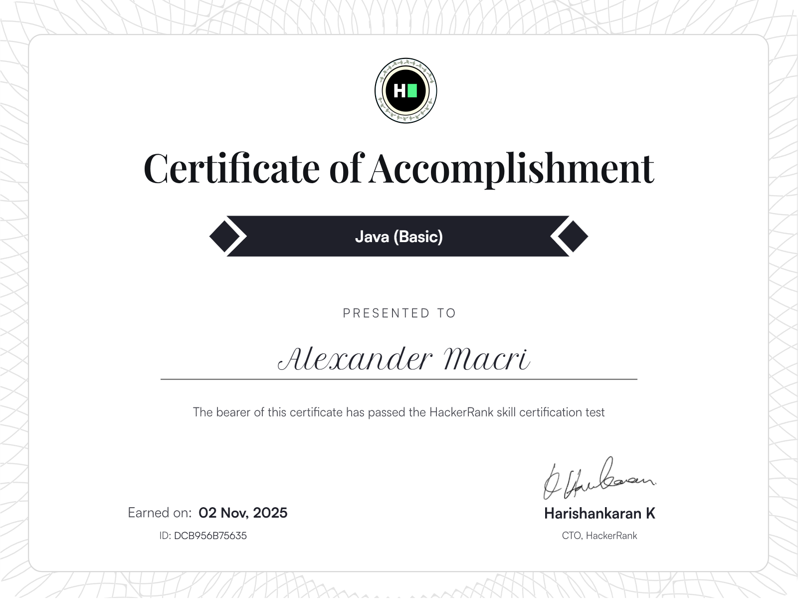

<h1 align="center">Hi 👋, I'm Rao-code</h1>

 

<ul>
    
<h2 style="display: inline-block" > GitHub Stats</h2>

</ul>

  
  
   
  
  <!-- 
   -->

- 🎓 I am currently pursuing my **PhD in Artificial Intelligence**.
- 🌱 I am currently learning **LeetCode and doing research in the domain of AI & ML**.
- 🎯 My Goal is to Contribute to as many **open source project and grow up Coding Communitity** as possible.
- ✨ I love to participate international **Coding Competitions**.
- 💬 Ask me about **Machine Learning, Deep Learning, LLM, Computer Vision**

- 📫 How to reach me **raohook.codes@gmail.com**

<h3 align="left">Languages and Tools:</h3>

               

<!-- 

&nbsp;

 -->
